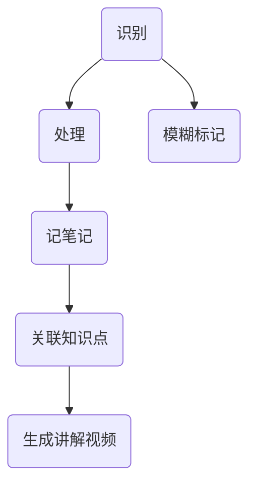

# 定位-听课辅助系统
### 意义
1. 有时候上水课或者老师讲课知识密度很低，不想浪费时间又不想错过重点内容
2. 上课不会记笔记，记笔记太慢跟不上节奏
3. 留出来更多时间在思考而非写字
### 特色
1. 实时笔记❓视听同步似乎比较难实现
2. 兜底机制：不确定->标记->附上原始信息(板书音频)
3. 智能讲解
# 核心功能

- 识别上课所讲内容;疑问标记--标记模糊或不明确的地方
- 梳理老师上课所讲内容
- 上传书本资料pdf/照片(若有)
- 在资料上记下笔记内容
- 智能关联相关知识点
- 生成更精简的讲解视频，在pdf/照片上进行实时标记演算
