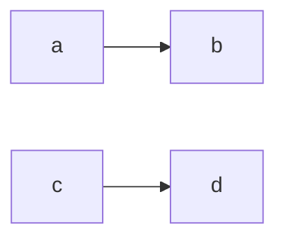
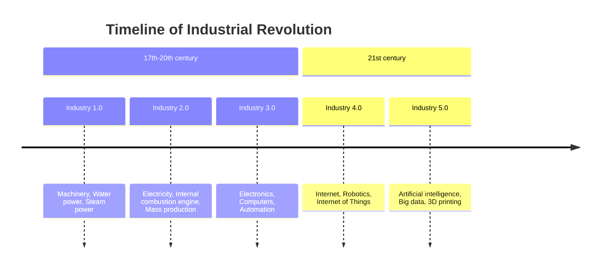
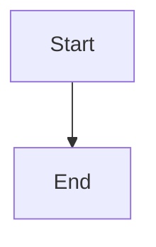

# 1 荧光笔

> <mark style="background-color: #87CEEB;">天蓝色高亮文本</mark>
> <mark style="background-color: #FFC0CB;">玫瑰粉高亮文本</mark>
> <mark style="background-color: #FFFACD;">柠檬黄高亮文本</mark>
```txt
<mark style="background-color: #87CEEB;">天蓝色高亮文本</mark>
```
```txt
<mark style="background-color: #FFC0CB;">玫瑰粉高亮文本</mark>
```
```txt
<mark style="background-color: #FFFACD;">柠檬黄高亮文本</mark>
```

# 2 字体颜色

> <span style="color:red">红色文字</span>

# 3 颜色查询

> [颜色查询网址](https://www.quanxiaoha.com/tools/rgb-color-chart)

# 4 字体

> <font face="黑体">黑体</font>
> <font face="微软雅黑">微软雅黑</font>
> <font face="STKaiti">楷体</font>
> <font face="STSongti">宋体</font>
> <font face="黑体" color="#0099ff" size="4" background-color: #FFFACD>这是黑体、蓝色、4号字</font>

# 5 <span style="color: red ;">同时设置多种样式</span>
> <span style="color: blue; font-size: 20px; line-height: 1.8; background-color: #ffffcc;">这是一段设置了综合样式的文本</span>
```txt
<span style="color: blue; font-size: 20px; line-height: 1.8; background-color: #ffffcc;">这是一段设置了综合样式的文本</span>
```

# 6 [Emoji](https://emoji6.com/emojiall/#google_vignette)表情包
1. [Emoji](https://emoji6.com/emojiall/#google_vignette)
2. [win]+[.]

# 7 [Lucide](https://lucide.dev/)图标

# 8 常用ALT码
|     |           |            |
| --- | --------- | ---------- |
| 符号  | 名称        | Alt 码      |
| π   | Pi        | Alt + 227  |
| α   | Alpha     | Alt + 224  |
| β   | Beta      | Alt + 225  |
| γ   | Gamma     | Alt + 226  |
| Σ   | Sigma（大写） | Alt + 228  |
| σ   | Sigma（小写） | Alt + 229  |
| Δ   | Delta（大写） | Alt + 916  |
| δ   | Delta（小写） | Alt + 235  |
| θ   | Theta     | Alt + 952  |
| λ   | Lambda    | Alt + 955  |
| μ   | Mu        | Alt + 230  |
| °   | 度         | Alt + 0176 |
| ±   | 正负        | Alt + 0177 |
| ×   | 乘号        | Alt + 0215 |
| ÷   | 除号        | Alt + 0247 |
| √   | 根号        | Alt + 251  |
| ∞   | 无穷        | Alt + 236  |
| ≈   | 约等于       | Alt + 247  |
| ≠   | 不等于       | Alt + 8800 |
| ≤   | 小于等于      | Alt + 8804 |
| ≥   | 大于等于      | Alt + 8805 |
# 图表
### gragh

### timeline

### flowchart

