# 俄语 Ⅰ 级名词的性与物主代词练习

## 一、名词的性梳理

根据文档内容，俄语名词按词尾特征可分为阳性、中性、阴性三类，具体分类及示例如下：

| 词性  | 词尾特征                                      | 示例（俄语 - 汉语）                                                                                                                              | 特殊说明                                                                                                               |
| --- | ----------------------------------------- | ---------------------------------------------------------------------------------------------------------------------------------------- | ------------------------------------------------------------------------------------------------------------------ |
| 阳性  | 1. 硬辅音结尾  2. -й结尾  3. 部分 -ь结尾 | 1. дом- 房子、стул- 椅子、завод- 工厂  2. музей- 博物馆、трамвай- 有轨电车、Китай- 中国  3. словарь- 词典、писатель- 作家、день- 白天                   | 1. 部分以 -а/-я结尾但表示男性的名词属阳性，如юноша- 男青年、дедушка- 祖父、дядя- 叔叔、Петя- 别佳  2. 部分外来词（如кофе- 咖啡）可作阳性                 |
| 中性  | 1. -о结尾  2. -е结尾  3. -мя结尾    | 1. письмо- 信、окно- 窗户、яблоко- 苹果  2. солнце- 太阳、поле- 田野、здание- 楼房  3. знамя- 旗帜、имя- 名字、время- 时间                          | 1. 以 -о/-е/-и/-ю/-у结尾的外来词多为中性，如радио- 无线电、пальто- 大衣、такси- 出租车、меню- 菜单  2. 部分中性名词复数形式特殊，如время-времена（时间） |
| 阴性  | 1. -а结尾  2. -я结尾  3. 部分 -ь结尾  | 1. книга- 书、мама- 妈妈、газета- 报纸  2. тётя- 婶婶、аудитория- 教室、девочка- 姑娘  3. кровать- 床、ночь- 夜、дочь- 女儿、мать- 母亲、тетрадь- 练习本 | 以 -ь结尾的阴性名词需重点记忆，避免与阳性混淆                                                                                           |

## 二、物主代词练习题目

### （一）基础匹配题（物主代词与名词性、数一致）

1. 请为下列名词选择正确的物主代词（мой/моя/моё/мои；твой/твоя/твоё/твои），并写出汉语意思。
    
    - （______） музей（博物馆，阳性）→ 答案：мой музей（我的博物馆）
    - （______） книга（书，阴性）→ 答案：моя книга（我的书）
    - （______） окно（窗户，中性）→ 答案：моё окно（我的窗户）
    - （______） стулья（椅子，阳性复数）→ 答案：мои стулья（我的椅子）
    - （______） тётя（婶婶，阴性）→ 答案：твоя тётя（你的婶婶）
    - （______） письмо（信，中性）→ 答案：твоё письмо（你的信）
2. 用物主代词 “наш/наша/наше/наши”（我们的）或 “ваш/ваша/ваше/ваши”（您的 / 你们的）填空，使句子语法正确。
    
    - ______ класс（教室，阳性）очень большой. → 答案：Наш класс（我们的教室）/ Ваш класс（您的 / 你们的教室）
    - Где ______ газета（报纸，阴性）? → 答案：наша газета（我们的报纸）/ ваша газета（您的 / 你们的报纸）
    - ______ пальто（大衣，中性）новое. → 答案：наше пальто（我们的大衣）/ ваше пальто（您的 / 你们的大衣）
    - ______ дети（孩子，复数）учатся в школе. → 答案：Наши дети（我们的孩子）/ Ваши дети（您的 / 你们的孩子）

### （二）选择题（判断名词性与物主代词匹配）

1. 下列选项中，物主代词与名词搭配正确的是（ ）
    
    A. моя музей（我的博物馆）
    
    B. твоё окно（你的窗户）
    
    C. их книга（他们的书，阴性）→ 注：их为第三人称物主代词，不分性数
    
    D. наш дом（我们的房子，阳性）
    
    答案：B、C、D（A 选项中музей为阳性，应搭配мой）
    
2. 下列以 -ь结尾的名词中，属于阴性且能与 “моя” 搭配的是（ ）
    
    A. словарь（词典，阳性）
    
    B. мать（母亲，阴性）
    
    C. тетрадь（练习本，阴性）
    
    D. писатель（作家，阳性）
    
    答案：B、C
    

### （三）句型转换题（结合否定句、选择疑问句）

1. 将下列肯定句改为否定句，注意物主代词与名词的一致。
    
    - Это моя тётя.（这是我的婶婶。）→ 答案：Это не моя тётя.（这不是我的婶婶。）
    - Там ваш институт.（那里是你们的学院。）→ 答案：Там не ваш институт.（那里不是你们的学院。）
2. 用 “или” 构成选择疑问句，并用正确物主代词回答。
    
    - Это ______ книга（你的书）или ______ газета（他的报纸）? → 问句：Это твоя книга или его газета? ；示例回答：Это моя книга.（这是我的书。）
    - Тут ______ музей（我们的博物馆）или ______ магазин（你们的商店）? → 问句：Тут наш музей или ваш магазин? ；示例回答：Тут наш музей.（这里是我们的博物馆。）

### （四）翻译题（汉译俄，重点考察物主代词与名词性匹配）

1. 我的妈妈在房子里。→ 答案：Моя мать в доме.（мать为阴性，搭配моя；дом为阳性，“在房子里” 用в доме）
2. 你们的教室很大，我们的教室很小。→ 答案：Ваш класс большой, наш класс маленький.（класс为阳性，分别搭配ваш和наш）
3. 这不是他的词典，而是她的练习本。→ 答案：Это не его словарь, а её тетрадь.（словарь为阳性，搭配его；тетрадь为阴性，搭配её）

# 介词&名词的性

```mermaid
mindmap
## 一、名词 - 表“人”的名词 - 日常称呼类：мама（阴）、папа（阳）、господин（阳）、госпожа（阴） - 人名类：Анна（阴）、Антон（阳）、Петя（阳）、юноша（阳） - 职业类：студент（阳）、студентка（阴）、математик（阳）、физик（阳）、инженер（阳）、ассистент（阳）、ассистентка（阴）、поэт（阳）、учитель（阳）、профессор（阳）、писатель（阳） - 亲属类：дядя（阳）、тётя（阴）、дедушка（阳）、бабушка（阴）、отец（阳）、мать（阴）、сын（阳）、дочь（阴）、брат（阳）、сестра（阴）、муж（阳）、жена（阴） - 身份类：сосед（阳）、девочка（阴）、человек（阳） - 表“物”的名词 - 日常物品类：стол（阳）、стул（阳）、лампа（阴）、дом（阳）、окно（中）、зал（阴）、книга（阴）、тетрадь（阴）、календарь（阳）、словарь（阳）、письмо（中）、газета（阴）、фотография（阴）、фото（中）、диск（阳）、рука（阴）、зуб（阳）、очки（复）、ножницы（复）、часы（复）、пальто（中）、костюм（阳）、платье（中）、брюки（复） - 食品/自然类：томат（阳）、банан（阳）、мёд（阳）、изюм（阳）、блин（阳）、пиво（中）、чай（阳）、луна（阴）、река（阴）、лес（阳）、поле（中） - 场所/机构类：школа（阴）、институт（阳）、завод（阳）、музей（阳）、магазин（阳）、вокзал（阳）、туалет（阳）、класс（阳）、кабинет（阳）、площадка（阴）、город（阳）、улица（阴） - 语言/学科/抽象类：язык（阳）、слово（中）、имя（中）、фамилия（阴）、отчество（中）、время（中）、день（阳）、ночь（阴）、зима（阴）、май（阳）、дата（阴）、денги（复） - 交通工具/工具类：трамвай（阳）、машина（阴）、судно（中） - 其他物品类：мел（阳）、меню（中）、радио（中）、какао（中）、шоссе（中）、теннис（阳）、футбол（阳）、шахматы（复）、вход（阳）、выход（阳）、съезд（阳）、знамя（中）、здание（中）、солнце（中）、борщ（阳） ## 二、介词 - 方位介词：в（在……里/内）、на（在……上）、у（在……附近/旁边）、из（从……里（出来））、к（向……（方向））、от（从……（离开）） - 时间介词：в（在……（时间点/月份/季节））、на（在……（星期/节日））、с（从……（时间开始））、до（在……之前/到……为止） - 对象/目的介词：для（为了……）、об（о）（关于……）、с（和……一起）、за（为了……（目的）/因……（原因））、без（没有……）
```
