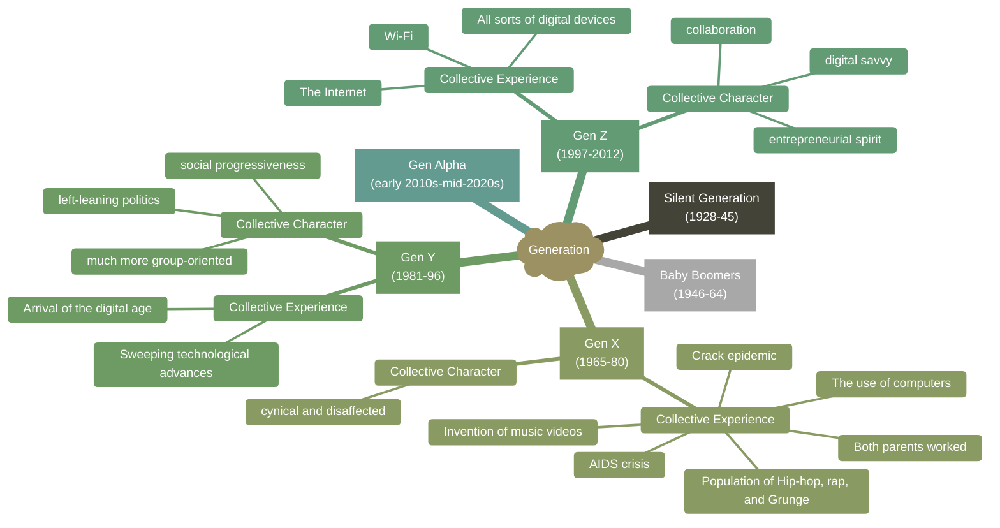
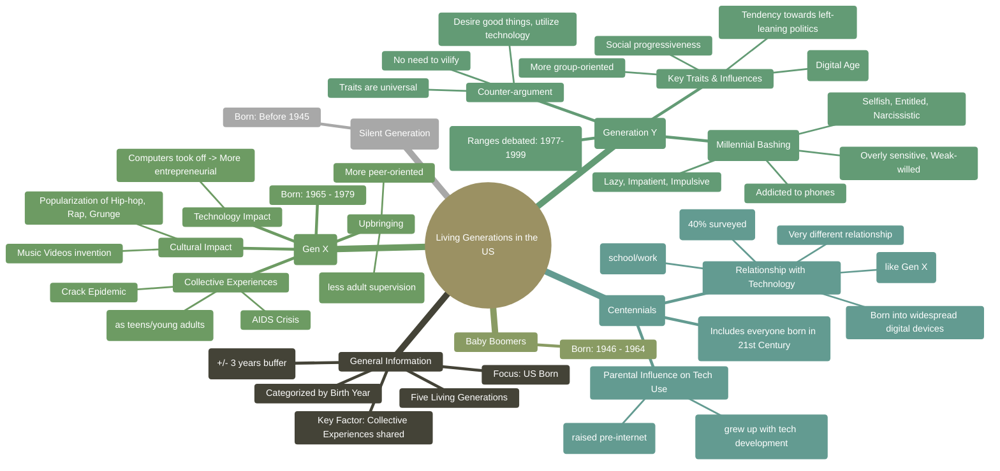

#2026-3-2 #大一下

```mermaid
---
config:
  theme: 'base'
  themeVariables:
    primaryColor: '#CDC8B1'
    primaryTextColor: '#fff'
    primaryBorderColor: '#7C0000'
    lineColor: '#F8B229'
    secondaryColor: '#8B8970'
    tertiaryColor: '#E8E8E8'
  layout: 'cose-bilkent'
---
			mindmap
				  root)Generation(
				    Gen["`Silent Generation<br/>(1928-45)`"]
				    Gen["`Baby Boomers<br/>(1946-64)`"]
				    Gen["`Gen X<br/>(1965-80)`"]
				      Collective Experience
				        The use of computers
				        Both parents worked
				        Crack epidemic
				        AIDS crisis
				        Invention of music videos
				        Population of Hip-hop, rap, and Grunge
				      Collective Character
				        cynical and disaffected
				    Gen["`Gen Y<br/>(1981-96)`"]
				      Collective Experience
				        Sweeping technological advances
				        Arrival of the digital age
				      Collective Character
				        much more group-oriented
				        social progressiveness
				        left-leaning politics
				    Gen["`Gen Z<br/>(1997-2012)`"]
				      Collective Experience
				        All sorts of digital devices
				        The Internet
				        Wi-Fi
				      Collective Character
				        digital savvy
				        entrepreneurial spirit
				        collaboration
				    Gen["`Gen Alpha<br/>(early 2010s-mid-2020s)`"]
```

AI

```mermaid
---
config:
  theme: 'base'
  themeVariables:
    primaryColor: '#CDC8B1'
    primaryTextColor: '#fff'
    primaryBorderColor: '#7C0000'
    lineColor: '#F8B229'
    secondaryColor: '#8B8970'
    tertiaryColor: '#E8E8E8'
  layout: 'tidy-tree'
---
  mindmap
  root((Living Generations in the US))
    General Information
      Five Living Generations
      Focus: US Born
      Categorized by Birth Year
      Birth Ranges: Approximations (+/- 3 years buffer)
      Key Factor: Collective Experiences shared

    Traditionalists (Silent Generation)
      Born: Before 1945

    Baby Boomers
      Born: 1946 - 1964

    Generation X (Gen X)
      Born: 1965 - 1979
      Upbringing
        Parents in workforce (less adult supervision)
        More peer-oriented
      Technology Impact
        Computers took off -> More entrepreneurial
      Collective Experiences
        Crack Epidemic
        AIDS Crisis
        Result: Cynical, Disaffected (as teens/young adults)
      Cultural Impact
        Music Videos invention
        Popularization of Hip-hop, Rap, Grunge

    Millennials (Generation Y)
      Born: 1980 - 1995 (Ranges debated: 1977-1999)
      Common Criticisms ("Millennial Bashing")
        Selfish, Entitled, Narcissistic
        Addicted to phones
        Lazy, Impatient, Impulsive
        Overly sensitive, Weak-willed
      Counter-argument
        Traits are universal
        No need to vilify
        Desire good things, utilize technology
      Key Traits & Influences
        Sweeping technological advances (Digital Age)
        More group-oriented
        Social progressiveness
        Tendency towards left-leaning politics

    Gen Z (Centennials)
      Born: 1996 - Present (Includes everyone born in 21st Century)
      Parental Influence on Tech Use
        Gen X Parents: More restrictive (raised pre-internet)
        Millennial Parents: More lenient (grew up with tech development)
      Relationship with Technology
        Born into widespread digital devices
        Very different relationship
        Digital savvy -> Entrepreneurial spirit (like Gen X)
        Value collaboration (school/work)
        Priority: Wi-Fi > Reliable Bathrooms (40% surveyed)
```
