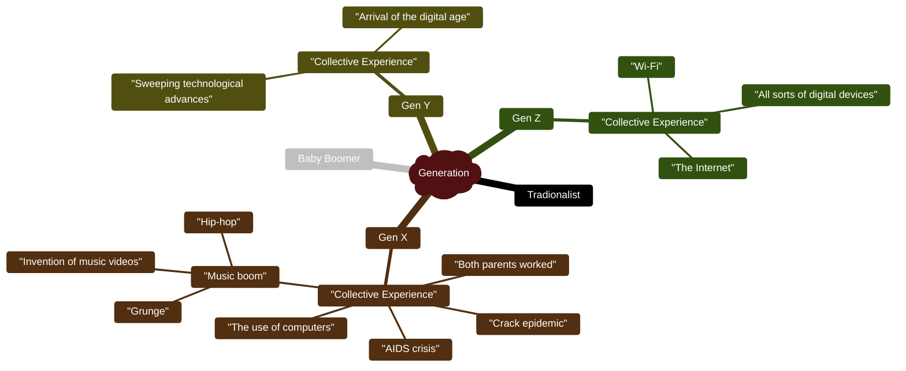

#2026-3-2 #大一下

```mermaid
---
config:
  theme: 'base'
  themeVariables:
    primaryColor: '#BB2528'
    primaryTextColor: '#fff'
    primaryBorderColor: '#7C0000'
    lineColor: '#F8B229'
    secondaryColor: '#006100'
    tertiaryColor: '#fff'
---
			mindmap
				  root)Generation(
				    Tradionalist
				    Baby Boomer
				    Gen X
				      "Collective Experience"
				        "The use of computers"
				        "Both parents worked"
				        "Crack epidemic"
				        "AIDS crisis"
				        "Music boom"
				          "Invention of music videos"
				          "Hip-hop"
				          "Grunge"
				    Gen Y
				      "Collective Experience"
				        "Sweeping technological advances"
				        "Arrival of the digital age"
				    Gen Z
				      "Collective Experience"
				        "All sorts of digital devices"
				        "The Internet"
				        "Wi-Fi"
```