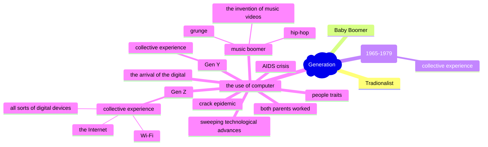

#2026-3-2 #大一下

```mermaid
mindmap
  root)Generation(
    Tradionalist
    Baby Boomer
    Gen X\(1965-1979)
	    collective experience
			the use of computer
		    both parents worked
		    crack epidemic
		    AIDS crisis
		    music boomer
			    the invention of music videos
			    hip-hop
			    grunge
	    people traits
		    
		    
    Gen Y
	    collective experience
			 sweeping technological advances
			 the arrival of the digital 
    Gen Z
	    collective experience
		    all sorts of digital devices
		    the Internet
		    Wi-Fi
```