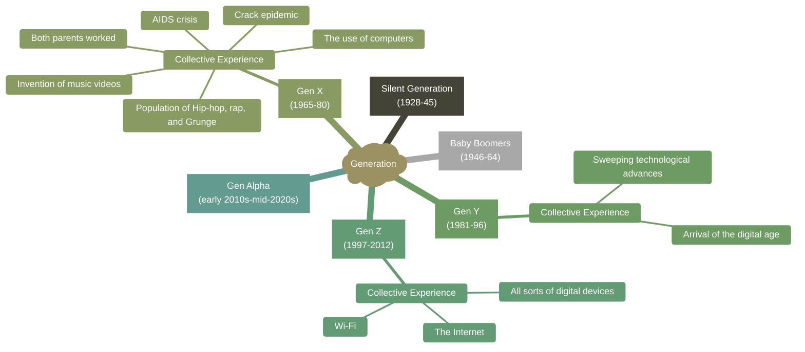

#2026-3-2 #大一下

```mermaid
---
config:
  theme: 'base'
  themeVariables:
    primaryColor: '#CDC8B1'
    primaryTextColor: '#fff'
    primaryBorderColor: '#7C0000'
    lineColor: '#F8B229'
    secondaryColor: '#8B8970'
    tertiaryColor: '#E8E8E8'
  layout: 'cose-bilkent'
---
			mindmap
				  root)Generation(
				    Gen["`Silent Generation<br/>(1928-45)`"]
				    Gen["`Baby Boomers<br/>(1946-64)`"]
				    Gen["`Gen X<br/>(1965-80)`"]
				      Collective Experience
				        The use of computers
				        Both parents worked
				        Crack epidemic
				        AIDS crisis
				        Invention of music videos
				        Population of Hip-hop, rap, and Grunge
				    Gen["`Gen Y<br/>(1981-96)`"]
				      Collective Experience
				        Sweeping technological advances
				        Arrival of the digital age
				    Gen["`Gen Z<br/>(1997-2012)`"]
				      Collective Experience
				        All sorts of digital devices
				        The Internet
				        Wi-Fi
				    Gen["`Gen Alpha<br/>(early 2010s-mid-2020s)`"]
```